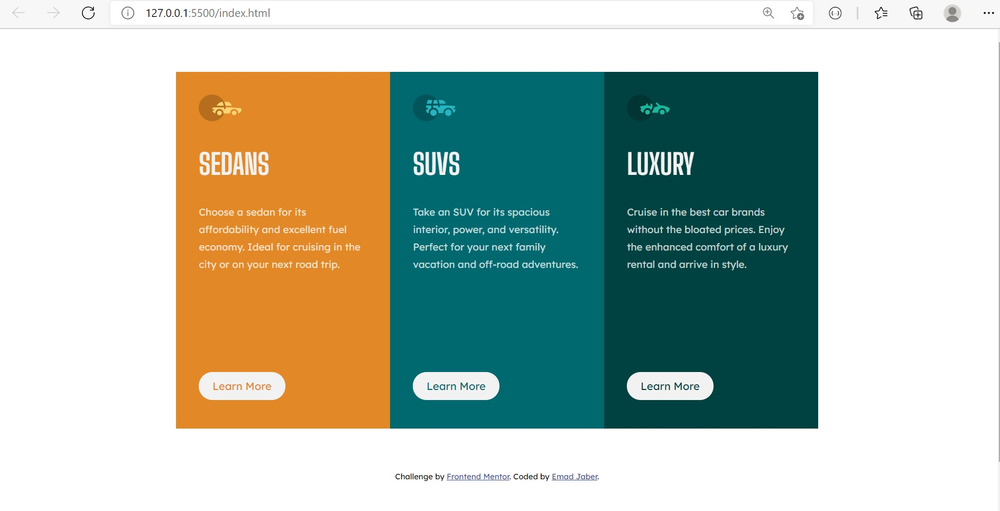
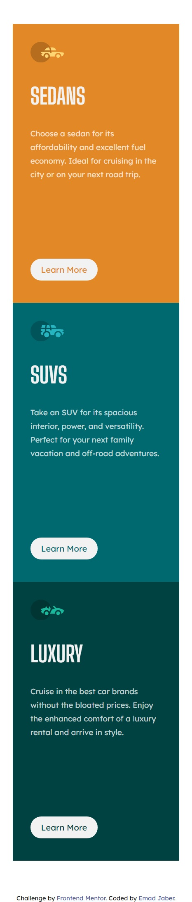

# Frontend Mentor - 3-column preview card component solution

This is a solution to the [3-column preview card component challenge on Frontend Mentor](https://www.frontendmentor.io/challenges/3column-preview-card-component-pH92eAR2-). Frontend Mentor challenges help you improve your coding skills by building realistic projects. 

## Table of contents

- [Overview](#overview)
  - [The challenge](#the-challenge)
  - [Screenshot](#screenshot)
  - [Links](#links)
  - [Built with](#built-with)
  - [What I learned](#what-i-learned)

- [Author](#author)

## Overview
This is my first challange in FrontEnd Mentor, I hope everyone sees it to give his comments and advice.

### The challenge

Users should be able to:

- View the optimal layout depending on their device's screen size
- See hover states for interactive elements

### Screenshot

### Links

- Solution URL:(https://github.com/emad2411/3-column-preview-card-component)

### Built with

- Semantic HTML5 markup
- CSS custom properties
- Flexbox

### What I learned

This was a good experience to apply what I learned in CSS like Flexbox

## Author

- Website - [Emad Jaber ](https://github.com/emad2411)
- Frontend Mentor - [@emad2411](https://www.frontendmentor.io/profile/emad2411)
